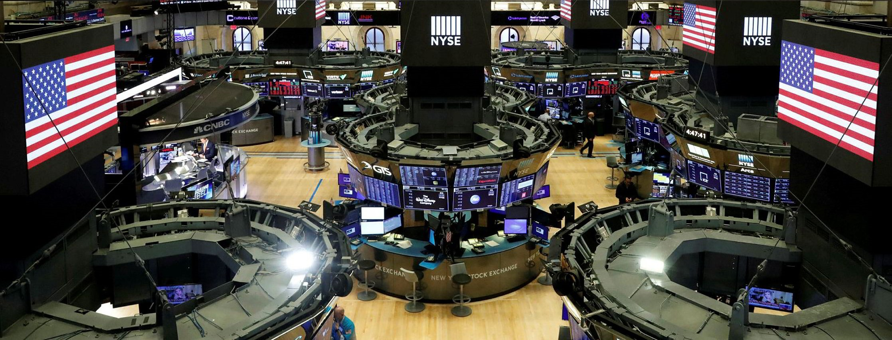
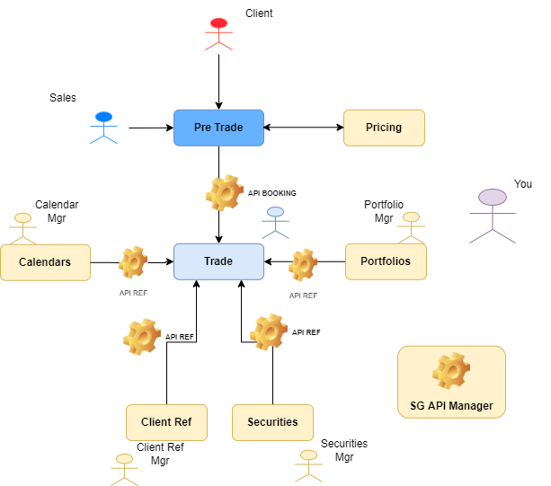

# Scenario booking issue

---

At Société Générale, Sales are responsible for finding and interacting with clients to sell financial products. The range of products varies from investment (buying / selling stocks to bet on the market moves, buying Bonds to get long term fixed income gains...) to financing (raising money to fund a new project…). When a client is interested in a product, Sales negotiate the terms of the contact (Price, Quantity, Maturity Date…) and record it in dedicated systems, from where it feeds to multiple other systems, allow the Traders to view all positions held by SG and hedge them to reduce the risk…. Performance and stability of our Information Systems are very important as Sales must be able to book the deals in the systems right after the negotiation to ensure that the product price does not move in an unfavorable direction until the deal is fully recorded in our system. Any gap in deal value will be taken as a loss by Société Générale as we have to guarantee that the clients get what they negotiated for. SG is making profits by taking a 1% fee on the notional (Quantity x Negotiated Price) of each deal executed.

 
On parallel of Sales activity, our systems are also able to perform auto-negotiated deals, which do not require Sales intervention, RFQs are submitted electronically by the clients and deal is booked automatically if client agrees with the price.  

You are working as support analyst at Société Générale, in the team SG/TRD-SUP supporting booking applications system. The booking chain is composed of different systems:   

* **Pre-Trade application:** This application is used by Sales to negotiate deals with clients and then execute the agreed deal so that it can feed to the downstream systems.

* **Trade application:** This applications receives the deals information from the Pre-Trade application and books them by combining this information with information retrieved from multiple satellite systems (Referential, Pricing, Analytical Structure tools…). The Trade application will then manage the deal's lifecycle until its maturity. It is used by Traders to view and cover the positions in their portfolios, and Middle Office team to perform modifications on the deals when needed.

* **Market Calendar application:** Referential application that feed Trade application with Market Calendars. For example, if a Trader has booked a deal on SP500 US Market, Market Calendar application is going to feed Trade application with SP500 calendar and can prevent a booking booked on bank holiday. Referential team are using this application to create or update all markets calendars.

* **Portfolio Application: Referential application** that also feeds Trade application. All Trades need to be booked on specific portfolio, so that Traders can view the positions by Portfolio in real time. If a portfolio doesn't exist in this system, the booking can't be recorded. Referential team are owner of this system and have to create any new portfolio requested by the Trading.

* **Security Application:** Referential application that also feeds Trade application. Each time there is a new stock or contract on the market, Referential team have to replicate the stock or the contract on this system. If they don't the booking will fail.

* **Client Referential:** Referential application that also feeds Trade application. For each deal executed with a client, Trade

* **Pricing Application:** System connected to Pre-Trade tool to provide the best product price when negotiation occurs and set the Deal Price when execution is done.

* **SG API Manager:** System responsible for registering all SG APIs information, and validating the authenticity for every API call made between two SG applications.

See below the information system architecture:

---

# Incident #1

It is 3PM. The Sales, in the SG/EQD New York Team, has negotiated a major deal with a VIP client, VINCI, to buy a Security newly issued on the Market at the beginning of the day. This is a brand new product offered at SG from a new Exchange, and a new Team of Traders has been set up to cover the risk on these products. As the Sales is trying to insert a deal in the Pre-Trade application and is getting the below error:  

> Failure from ids 5301 to 12896, please contact your support team

The Sales insists for this issue to be resolved as soon as possible because the price for this new Security is moving very fast on its first day. And the deadline to book the deal is 4PM, after which the Exchange will be closed. You start your investigation right away.

Good luck with this first incident, please find below the link to access your information system and fix the issue:  
[INCIDENT 1](Booking%20Application%20System/INC1)
 
# Incident #2

Now that you have fixed the issue, the trader comes back to you saying he is still unable to book his deal as he is getting again the same error message.  

Good luck with this second incident, please find below the link to access your information system and fix the issue:  
[INCIDENT 2](Booking%20Application%20System/INC2)

# POST MORTEM EXERCISE

The problem is now solved and the Sales is very happy about your work as he managed to conclude this very important deal. However he is worried that other users or processes might have been impacted by this issue. He asks for proper Post Mortem to be written and communicated to upper Management, containing:

* The full business impacts (quantity of deals impacted, $...etc)
* The root cause
* The action plan you would implement in order to secure the production

You will find in the repository an example of [Post Mortem ](Post%20Mortem%20Template/PM1.PNG). For the communication to Management and Business, this you will obviously have to summarize the incident in the body of the email as they are usually too busy to open and read the full document

 

