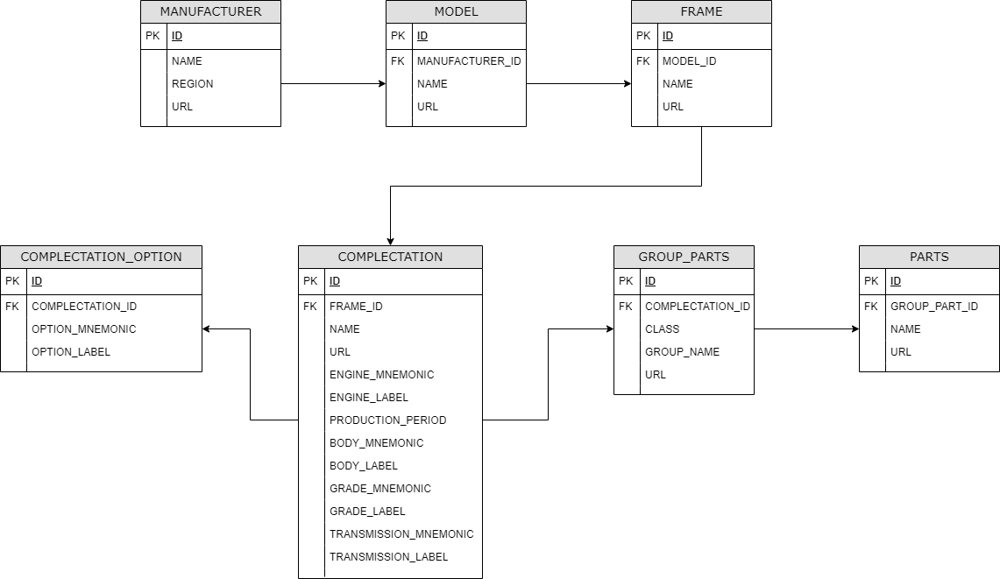

# Database and Sql


# Sqlite

We've created an Sqlite database that will serve as the basis for DB/SQL exercises.  
You can use the tools in this folder to open the database from a command line.  

On Windows, one can open the toyota database using this query
```cmd
"Sqllite Tools\Windows\sqlite3.exe" toyota.db
```
On Linux and OS X, it should look like this
```sh
.Sqllite\ Tools/Linux/sqlite3 toyota.db
.Sqllite\ Tools/OS\ X/sqlite3 toyota.db
```

## Sqlite documentation

The SQL syntax for interacting with the sqlite database is described [here on the official website](https://www.sqlite.org/lang.html).  
It is fairly straightforward, just remember to finish your queries with two semi-colons to execute a query on the database `;;`  

```sql
sqlite> select * from MANUFACTURER;;
```

To execute an `sqlite` command from the sqlite command line, no need for `;;`. See below an example to execute a script using the `.read` command
```cmd
sqlite> .read path/to/script.sql
```
The above will execute the script `script.sql`

# Toyota DB

We've created and initialized a Toyota vehicule parts database.  
The schema of that database is the following and should be fairly self-explanatory.  



One can see the tables in that database using the sqlite command `.table`
```cmd
sqlite> .table
COMPLECTATION          GROUP_PARTS            PARTS
COMPLECTATION_OPTIONS  MANUFACTURER
FRAME                  MODEL
```

For the purpose of the scenarios the reader can think of `complectations` as variations of the same frame.

We've also created a `toyota_no_parts` database that removes the biggest tables of the `toyota` DB.  
It contains the exhaustive set of models and complectations.  

## Scenarios

Candidate will face various scenarios involving the use and modification of an sqlite database using the command line.  
