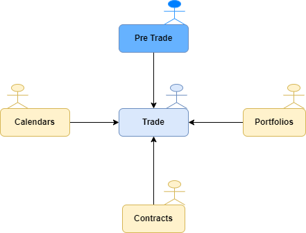

# Scenario booking issue

---

You are working as support analyst at Societe Generale, supporting booking applications system. The booking chain is compose of different systems:
* **Pre Trade application:** This applicqtion is used from the negociate with the client until the booking of the deal. It is used by trader.
* **Trade application:** Come after the booking, this is the downstream application that manage the lifecycle deal until the deal expire.It is used by trader's support assistant.
* **Market Calendard application:** Referential application that feed Trade application with Market calandar. For example, if a Trader has booked a deal on SP500 US Market, Market Calendard application is going to feed Trade application with SP500 calandar and can prevent a booking booked on bank holiday. Referential team are accountable of this system have to create or update all markets calandars.
* **Portfolio Application:** Referential application that also feed Trade application. All Trades need to be booked on specific portfolio. If a portfolio doesn't exist in this system, the booking can't be recorded. Referential team are owner of this system. They have to create any new portfolio requested by the Trading.
* **Contract Application:** Referential application that also feed Trade application. Each time there is a new stock or contract on the market, Referential team have to replicate the stock or the contract on this syste,. If they don't the booking will failed.  

See below the information system architecture:

---

# Incident #1

Following a negociation with a VIP client, the trader were trying to insert q deal in the **Trade application** and is getting the below error:  
`Error on booking_id 157893, please cqll your support team`
